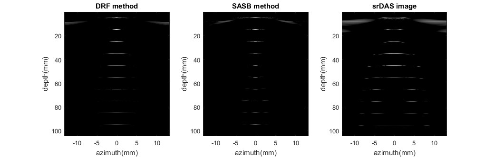
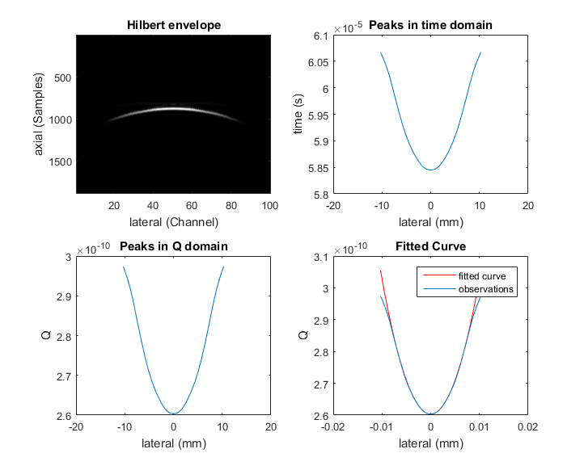

This software package is a collection of MATLAB functions for simulating several ultrasound beamforming methods and a new developed speed-of-sound (SOS) estimation method using the Field II simulation software [1]. Currently, it supports the simulation of three beamforming algorithms: Synthetic Aperture Sequential Beamforming (SASB) [2], Dynamic Receive Beamforming (DRF), and Single Receive-focused Delay-and-Sum Beamforming (srDAS). See [3] for details. To execute the modules provided in this package, a correct installation of the Field II package is required.

This package consists of four types of functions:

### Per-Channel Radio Frequency (RF) data generation functions

These scripts are listed in the sub-folder 'RF_data_generation'. Two per-channel RF data generation scripts are provided. The 'RF_generate.m' file simulates a focused transmission in a one-layer medium; whereas the 'RF_twoLayers.m' file simulates a focused transmission in a two-layer phantom with two distinct SOSs. This is achieved by compensating for the time-of-flight (TOF) difference in a one-layer and two-layer phantom.

### Beamforming Functions
Three beamforming methods are included in the package: the DRF method, the SASB method, and the srDAS method. These beamforming functions are located in the folder 'beamforming_function'. The output of these three beamforming methods using a point spread function phantom is shown in .

### SOS Estimation and Correction Functions
The SOS can then be calculated based on the srDAS image of the phantoms. These functions are located in the folder 'SOS_estimation_function'. In the package, SOS estimation is performed by using a rectangle to highlight the region of interest. By setting the 'DisplayImage' flag, intermediate steps in SOS estimation can also be displayed, one of such plots is shown in .

### Helper Functions
There are also several auxiliary functions used to display images, calculated element center locations, and for other tasks. These functions are located in the folder 'helper_function'. The function used to display B-mode image is a modification of the code available on the Field II [1] website.

## Download
Please click [here](http://www.ece.ubc.ca/~manyoum/dual_stage_sos/dual_stage_sos.zip) to download a zip folder of this package.

## Getting started
After downloading and unpacking the zip folder, please ensure that the Field II [1] simulation software is installed correctly. The following script can be used to generate the graphs presented on this page.

```markdown
'clear all;
close all;

%% Generate the one layer RF signal
z_focus = 20/1000;
c = 1540;
c_assumed = 1540;
RF_generate;

%% Perform Beamforming
f_number_receive = 0.5;
f_number_transmit = 1.5;
% Dynamic receive beamforming method
subplot(1,3,1);
BF_DRF;
title('DRF method')

% SASB beamforming
subplot(1,3,2);
BF_SASB_1layer;
title('SASB method');

% srDAS image
subplot(1,3,3);
final_Image = first_stage_buffer;
IMG_make_image;
title('srDAS image');

pause;

%% Perform SOS estimation
num_para = 1;

% perform saDAS beamforming and region of interest selection
SOS_estimateFromLRI_step1_select;
% estimate sos in the region of interest
SOS_estimateFromLRI_step2

disp(['The estimatated SOS at this point is ', num2str(round(velocity_vector)), 'm/s' ]);'
```

For more details see [GitHub Flavored Markdown](https://guides.github.com/features/mastering-markdown/).

### Jekyll Themes

Your Pages site will use the layout and styles from the Jekyll theme you have selected in your [repository settings](https://github.com/manyouma/dual_stage_sos/settings). The name of this theme is saved in the Jekyll `_config.yml` configuration file.

### Support or Contact

Having trouble with Pages? Check out our [documentation](https://help.github.com/categories/github-pages-basics/) or [contact support](https://github.com/contact) and we’ll help you sort it out.
